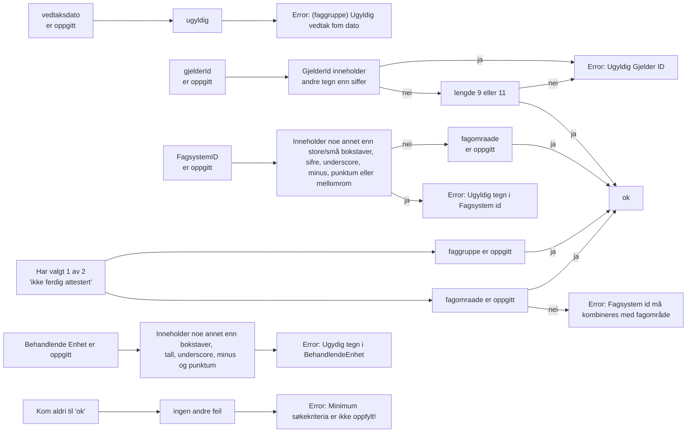
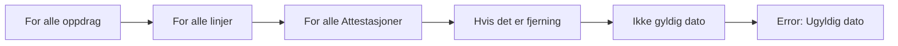
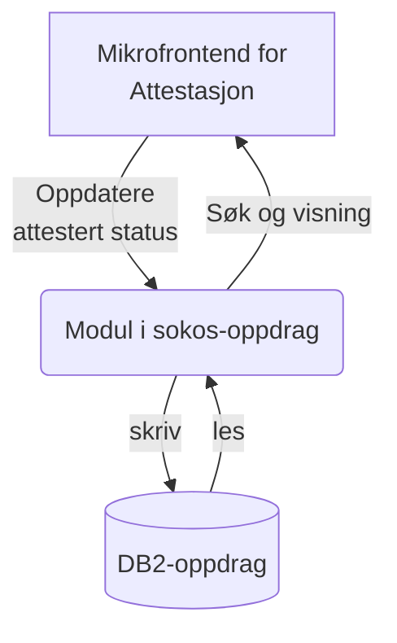

# Attestasjon

## Validering av Søk



## Validering av utfylt tabell i Detaljer



## Data

K231M782MsgVO
K231M5IDVO
K231M690VO attester
K231M710VO skattevedtak
K231M740VO maksbeløp

# Overordnet systemskisse


## Mikrofrontend for Attestasjon

Mikrofrontend-template er en mal for frontendapplikasjoner som vi bruker som utgangspunkt.

## Modul i sokos-oppdrag
Sokos-oppdrag er en "modulær monolitt" som allerede har nødvendig konfigurasjon for å snakke med DB2-oppdrag. 
Det ser ut til å være de samme tabellene som oppdragsinfo bruker.

## Database
Spørringer for å hente ut data kan vi hente fra skjermbildet i Økonomiportalen.


```
		select  
			g.kode_faggruppe		as {att.faggruppe}
		  , g.navn_faggruppe		as {att.faggruppeNavn}
		  , o.kode_fagomraade		as {att.fagomraade}
		  , f.navn_fagomraade		as {att.fagomraadeNavn}
		  , o.oppdrags_id			as {att.oppdragsId}
		  , o.fagsystem_id			as {att.fagsystemId}
		  , o.oppdrag_gjelder_id	as {att.gjelderId}
		  , f.ant_attestanter		as {att.antall}
		  
		  , l.linje_id				as {att.linjeId}
		  , l.attestert				as {att.attestert}
		  , l.dato_vedtak_fom		as {att.vedtakFom}
		  , l.dato_vedtak_tom		as {att.vedtakTom}
		  
		  , ls.kode_status			as {att.statusKode}  
		  
		from t_faggruppe g join t_fagomraade f on g.kode_faggruppe = f.kode_faggruppe
			join t_oppdrag o on f.kode_fagomraade = o.kode_fagomraade 
			join t_oppdragslinje l on o.oppdrags_id = l.oppdrags_id
			join t_oppdrag_status s on s.oppdrags_id = l.oppdrags_id
			join t_linje_status ls on ls.oppdrags_id = l.oppdrags_id and ls.linje_id = l.linje_id
			left outer join t_korreksjon k on l.oppdrags_id = k.oppdrags_id and l.linje_id = k.linje_id
		where k.oppdrags_id IS NULL
		  and digits(o.oppdrags_id)			> :nextOppdragsId

		  and s.kode_status = 'AKTI'
		  and s.tidspkt_reg = ( select max(s2.tidspkt_reg)
								from t_oppdrag_status s2 
								where s.oppdrags_id = s2.oppdrags_id)

  		  and ls.tidspkt_reg = (select max(tidspkt_reg)
  		  					 from t_linje_status ls2
                 			 where ls2.oppdrags_id = ls.oppdrags_id
                			   and ls2.linje_id = ls.linje_id)
  
		  and f.kode_fagomraade 			= 	:kodeFagomraade
		  and o.oppdrag_gjelder_id 			= :gjelderId
		  and o.fagsystem_id 				like :fagsystemId
		  and l.attestert 					like :attestert
		  
		order by o.oppdrags_id
		fetch first 200 rows only
		optimize for 1 row
		with cs
		for fetch only
```
